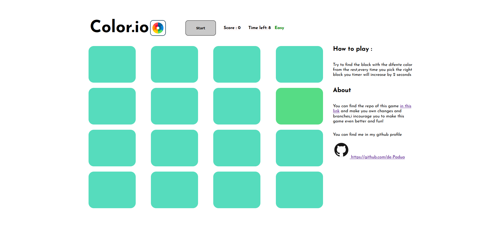

# Color.io 🌈

## Sobre o jogo 
* Projeto
* Tecnologia 
* Estrutura

### Projeto

A ideia é simples,um jogo 16 blocos contém uma cor e um deles estará diferente,o objetivo é acertar o máximo possível antes do tempo acabar,e quando mais você acerta,mais dificil fica.

### Tecnologia

Usei vanilla javascript e vanilla css,nada muito _fancy_ ,mas bem estruturado e planejado.

### Estrutura
Usei classes,não sei se foi a melhor escolha mas classes são úteis para projetos assim,para futura atualizações farei refatoração.

#

#### Have fun!  😎